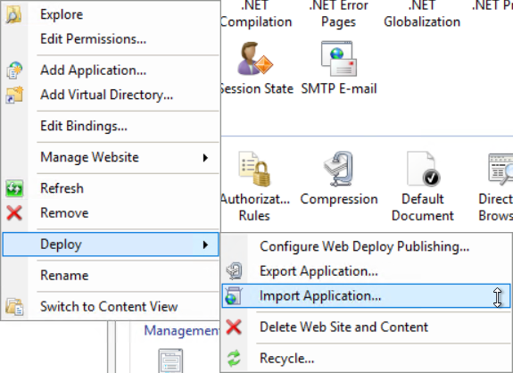

= Smittestopp Backend

image:https://github.com/folkehelseinstituttet/Fhi.Smittestopp.Backend/workflows/.NET%20Core/badge.svg[]
image:https://img.shields.io/github/issues/folkehelseinstituttet/Fhi.Smittestopp.Backend[]
image:https://img.shields.io/github/issues-pr/folkehelseinstituttet/Fhi.Smittestopp.Backend[]
image:https://img.shields.io/github/last-commit/folkehelseinstituttet/Fhi.Smittestopp.Backend[]

WebAPI project, which facilitates receiving, storing and distributing Temporary Exposure Keys
footnote:[https://google.github.io/exposure-notifications-server/getting-started/publishing-temporary-exposure-keys.html[Temporary Exposure Key (TEK) Publishing Guide]].

Mobile devices can use these keys to detect exposures and send notifications to the users.
To do that, the devices utilize Exposure Notification API
footnote:[https://developers.google.com/android/exposure-notifications/exposure-notifications-api[Exposure Notifications API documentation]] provided by Apple and Google.

== Installation

Installation process goes in the same way as with any other WebAPI project.
For example, you could use `Web Deploy` feature of IIS but other methods work fine as well.

Keep in mind that routes to all endpoint already have `api` prefix in them.
_Remove the suggested `api` from `Application Path` when importing to not have this prefix duplicated_.

=== Requirements
To run the project you need `ASP.NET Core Runtime`.
Any version starting with `3.1` should work fine i.e., `3.1.10`.
Choose `Hosting Bundle` when choosing runtime version.

The project unfortunately has a couple of Windows dependencies and because of it, **you need to run it on Windows**.

.Windows dependencies
. It uses
Data Protection API
footnote:[https://en.wikipedia.org/wiki/Data_Protection_API[Data Protection API]] for encryption.
. It runs
Hangfire footnote:[https://www.hangfire.io/[Hangfire website]] as a Windows service.
. It writes logs to Windows EventLog
footnote:[https://docs.microsoft.com/en-us/aspnet/core/fundamentals/logging/?view=aspnetcore-5.0#welog[Windows EventLog]],
if configured to do so.

=== Registering EventLog
To initiate EventLog for settings mentioned above you can run this PowerShell script with administrator rights:

[source]
----
$file = "C:\Windows\Microsoft.NET\Framework64\v4.0.30319\EventLogMessages.dll"
New-EventLog -ComputerName . -Source "SS-API-DIGNDB.App.SmitteStop" -LogName Application -MessageResourceFile $file -CategoryResourceFile $file
New-EventLog -ComputerName . -Source "SS-Jobs-DIGNDB.App.SmitteStop" -LogName Application -MessageResourceFile $file -CategoryResourceFile $file
----
**Without this initialization no logs will appear in the Event Viewer.**

=== Hangfire as a service
To create a service, which will run Hangfire execute the command below (in Command Prompt).

[source]
----
sc create "SmittestopHangfire" binpath="C:\SmittestopHangFire\DIGNDB.APP.SmitteStop.Jobs.exe"
----

=== Creating cleaning SQL job
To ensure that keys older than 14 days won't clutter the database,
run the SQL command from this file link:sql/create-cleaning-sql-job.sql[].

== Usage

To use this `WebAPI` project you need an HTTP Client.
Both mobile devices and frontend frameworks can use some HTTP Client to consume the API.

=== Swagger
To describe API endpoints, project makes use of Swagger.

Request on root endpoint `/` will result in getting `Swagger UI` page, presented below.

Swagger along with the documentation also provides a functionality called _playground_.
Click `Try it out` and then `Execute` to send an HTTP request without a need for any HTTP client.

_For security reasons, this functionality works only in `development` environments_.

=== Hangfire

==== Jobs

On 14.12.2020 Hangfire exposes 3 jobs, which you can execute.

. `validate-keys-on-database` - removes invalid keys from the database.
. `update-zip-files` - generates zip files from existing keys.
. `remove-old-keys` - removes old zip files from the disk.

=== Configuration

The project uses the standard `ASP.NET Core` mechanism for splitting configuration for different environments.
To get yourself familiar with the concept take a look at this article https://docs.microsoft.com/en-us/aspnet/core/fundamentals/environments?view=aspnetcore-3.1[Use multiple environments in ASP.NET Core]

==== Mobile token

Some endpoints require a _mobile token_ because of `MobileAuthorizationAttribute` attribute.
This token provides static authentication mechanism between the backend and the mobile app.

You need to provide this token to `appsettings.json` configuration for all environments apart from `development`.

.appsettings.json
[source,json]
----
{
  "AppSettings": {
    "AuthorizationMobile": "To be replaced in Pipelines"
  }
}
----

To generate this token just pick a random string (treat it like a password, the longer and higher the entropy the better), share it with the mobile team, encrypt it using `ConfigEncryptionHelper.ProtectString` and put it as `AuthorizationMobile` value.
This method `ProtectString` uses `Data Protection API` under the hood, so you need to **repeat this encryption for each server**.

**If the API application runs as `apppool` user then this user needs to perform the encryption (call to `ProtectString`).**
**If user A performs the encryption and user B will try to decrypt the token then the decryption will fail.**

==== JWT validation
Endpoint `POST /diagnostickeys` uses JWT token to authenticate the client.

You can configure some JWT validation rules using the configuration below.

.appsettings.json
[source,json]
----
{
  "JwtAuthorization" : {
    "JwtValidationRules": {
      "ClientId": "To be replaced in Pipelines",
      "SupportedAlgorithm": "RS256",
      "Issuer": "To be replaced in Pipelines"
    },
    "JwkUrl": "To be replaced in Pipelines"
  }
}
----
* `ClientId` - Client id from the token, which we consider valid.
* `SupportedAlgorithm` - Supported signature algorithm, which we consider valid.
* `Issuer` - Issuer from the token, which we consider valid.
* `JwkUrl` - Url from which the validator service will retrieve _the public key_.

==== API version deprecation
`AppSettings` section of `appsettings.json` configuration enables setting a specific version of API as deprecated.

To set version `1` and version `2` as deprecated put `"1"` and `"2"` strings into `DeprecatedVersions` array.
Use example below for reference.

.appsettings.json
[source,json]
----
{
  "AppSettings": {
    "DeprecatedVersions": [
      "1",
      "2"
    ]
  }
}
----

Calling an endpoint in deprecated version will result in getting a response with the code `410` and content `API is deprecated`.

==== Logging configuration
The project uses different logging solutions when it comes to backend logs and mobile logs.

===== Backend logs
Backend uses solution provided by the framework, described in
https://docs.microsoft.com/en-us/aspnet/core/fundamentals/logging/?view=aspnetcore-5.0[Logging in .NET Core and ASP.NET Core].
`Startup` class calls `AddFile` extension method to also save logs to a file.

===== Mobile logs
Application running on devices pushes its logs using `/logging/logMessages` endpoint.
`LoggingController` receives those logs and saves them using `log4net` package.
This package uses `log4net.config` configuration file.

==== Shared folder for zips
To accomplish failure resilience, configure `appsettings` configuration (of `Jobs` project) to have multiple record in `ZipFilesFolders` array.

[source,json]
----
{
  "ZipFilesFolders": [
    "C:\\SmitteStopNO\\SmittestopTemporaryExposureKeyZipFiles"
  ]
}
----

== Contributing

=== Unused code

Don't feel surprised to find some portions of unused code.
As an example, you won't find any logical usages of `Translation` table or whole `FederationGatewayApi` project.
Development team removed the code using it because the project should not integrate with
https://github.com/eu-federation-gateway-service/efgs-federation-gateway[EU Federation Gateway Service] for now.

=== Patterns used in the project

==== Generic repository

To access the database please use `GenericRepository<T>` class.
Feel free to create a custom repository class based on the generic one if needed.

==== Dependency registration

Each module should have its dependencies registered in a separate extension method.

For example in `DIGNDB.App.SmitteStop.DAL` module we have a method presented below.

[source,c#]
----
public static class ContainerRegistration
{
    public static IServiceCollection AddDALDependencies(this IServiceCollection services)
    {
        services.AddScoped<IJwtTokenRepository, JwtTokenRepository>();
        services.AddScoped<ICountryRepository, CountryRepository>();
        services.AddScoped(typeof(IGenericRepository<>), typeof(GenericRepository<>));

        return services;
    }
}
----

This pattern provides a number of benefits.

. It keeps all the registration calls in one place per module.
. It enables marking some implementation classes as internal (encapsulation).
. It the need for mocking in unit tests (see link:./DIGNDB.App.SmitteStop.Testing/ServiceTest/JwtValidationServiceTests.cs[JWT validation tests] as an example).

=== Database connection
To develop the project you need a working `SQL Server` instance.
You can either use a local instance or a `Docker` container.

==== Entity Framework Code First
The project utilizes `Code First` with Migrations approach when using `Entity Framework` package.

Please pay attention when running `dotnet ef` commands.
The database context lays in different project (`DIGNDB.App.SmitteStop.DAL`)
than the `API` so you need to specify the context project each time.

For example to create a new migration run the following command:

[source]
----
DIGNDB.App.SmitteStop\DIGNDB.App.SmitteStop.API>dotnet ef migrations add <MigrationName> --project ../DIGNDB.App.SmitteStop.DAL
----

== License
Copyright (c) 2020 Agency for Digitisation (Denmark), 2020 Norwegian Institute of Public Health (Norway), 2020 Netcompany Group AS

Smittestopp is Open Source software released under the link:LICENSE.md[MIT license]
