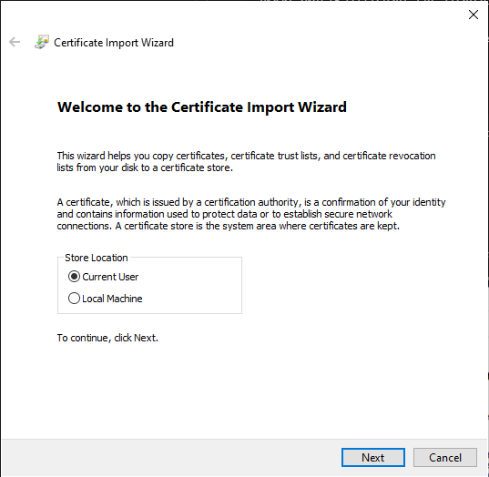
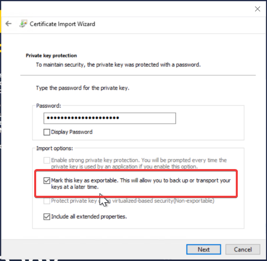
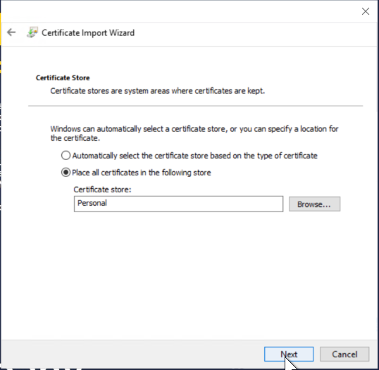
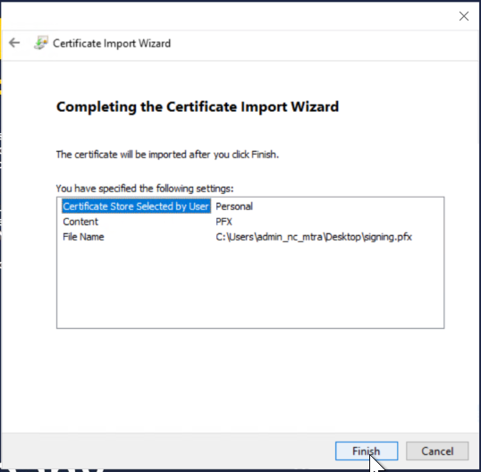

# Introduction 
TODO: Give a short introduction of your project. Let this section explain the objectives or the motivation behind this project. 

# Getting Started
TODO: Guide users through getting your code up and running on their own system. In this section you can talk about:
1.	Installation process
2.	Software dependencies
3.	Latest releases
4.	API references

# Build and Test
TODO: Describe and show how to build your code and run the tests. 

# Contribute
TODO: Explain how other users and developers can contribute to make your code better. 

If you want to learn more about creating good readme files then refer the following [guidelines](https://docs.microsoft.com/en-us/azure/devops/repos/git/create-a-readme?view=azure-devops). You can also seek inspiration from the below readme files:
- [ASP.NET Core](https://github.com/aspnet/Home)
- [Visual Studio Code](https://github.com/Microsoft/vscode)
- [Chakra Core](https://github.com/Microsoft/ChakraCore)

# Maintenance

## Migrations
### Command for creating a new migration
`DIGNDB.App.SmitteStop\DIGNDB.App.SmitteStop.API>dotnet ef migrations add <MigrationName> --project ../DIGNDB.App.SmitteStop.DAL`

## Communication with EU Federation Gateway Service

### Client certificates

#### Generation of self-signed certificate
To communicate with the gateway you need to authenticate using a client certificate.
For now using the self-signed certificate is enough. 

To create a self-signed certificate you might use the command below:
```bash
openssl req -x509 -new -days 365 -newkey ec:<(openssl ecparam -name prime256v1) -extensions v3_req -subj "/CN=FGS Netherlands/OU=Corona-Team/O=Ministry of Public Health/emailAddress=operations@coronateam.nl/L=the Hauge/C=NL" -keyout privkey.pem -nodes -out pub.pem
```
Tip - use linux version of openssl
1. Install linux subsystem for Windows
2. Go to and download linux appx https://docs.microsoft.com/en-us/windows/wsl/install-manual


(Gateway documentation provides this example in 
[Appendix A](https://github.com/eu-federation-gateway-service/efgs-federation-gateway/blob/master/docs/software-design-federation-gateway-service.md#appendix-a) 
but on 31.08.2020 it has a typo in it.
I provided a corrected example above.)

To get a fingerprint (also known as thumbprint) execute the command below:
```bash
openssl x509 -in pub.pem -noout -hash -sha256 -fingerprint
```

Output of the fingerprint command should have the following format:
```
9f737079
SHA256 Fingerprint=EC:D4:19:37:83:40:C2:9A:16:C9:B6:CC:51:68:F3:4A:13:B3:D9:1B:9E:2E:2C:32:D9:B2:39:EE:E1:9A:3A:AD
```

Before using the certificate you need to convert it using this command:
```bash
openssl pkcs12 -export -in pub.pem -nokeys -password pass:BardzoDobreHaslo -out pub.p12
```

##### Additional information about the certificate

To get additional information about the certificate use the command below:
```bash
openssl x509 -in pub.pem -text
```

#### Importing client certificate to Gateway

For now the fastest way to add the certificate to the gateway whitelist is to add it directly into the database using the SQL:
```mysql
INSERT INTO fg.certificate (id, created_at, thumbprint, country, type, revoked, host)
VALUES (2, 
        '2020-08-31 10:50:43', 
        'ECD419378340C29A16C9B6CC5168F34A13B3D91B9E2E2C32D9B239EEE19A3AAD', 
        'NL',
        'AUTHENTICATION', 
        null, 
        'localhost');
```

As for the `type` column as there are three types of certificates 
(source: [EFGS Federation Gateway repository](https://github.com/eu-federation-gateway-service/efgs-federation-gateway/blob/master/docs/software-design-federation-gateway-service.md#1-definitions))
there are also three types available:

* `AUTHENTICATION`
* `SIGNING`
* `CALLBACK`

### Importing test certificates to API

#### Importing to Windows Certificate Store
You need to import certificates to _Windows Certificate Store_ because our test servers
run on _Windows_ operating systems. 

To do that double-click on the `.pfx` file and you'll be greeted with the following screen:


Choose `Current User` there and click `Next`.

On next screen with `File to Import` just click `Next` to confirm the double-clicked `.pfx` file.

When importing the private key provide a correct password.
Go to [Password for test certificates which are in repository section](#password-for-test-certificates-which-are-in-repository) 
to get password for certificates available in this repository.

**You need to mark the key as exportable to be able to import it in `C#` code.**



Place the certificate in `Personal` store because `C#` code gets certificates from it.



Finally, just click `Finish`.



##### Possible issues when importing
We have speculations that `Group Policy` might be deleting imported certificates on the restart.
If you have it deleted just add it again.


#### Using client certificate on client side

##### Certificate headers

Gateway requires to add two additional headers to each request.

1. `X-SSL-Client-SHA256` with value of fingerprint eg. `ECD419378340C29A16C9B6CC5168F34A13B3D91B9E2E2C32D9B239EEE19A3AAD`
1. `X-SSL-Client-DN` with value representing country eg. `C=NL`

##### Adding certificate to client
Depending on a client you use follow one of the tutorials below:

* [Postman](https://learning.postman.com/docs/sending-requests/certificates)
* [Insomnia](https://support.insomnia.rest/article/51-client-certificates)
* [.Net](https://stackoverflow.com/questions/40014047/add-client-certificate-to-net-core-httpclient)

## Signing key batch
Gateway endpoint for uploading diagnosis keys (`[POST] /diagnosiskeys/upload`) requires `batchSignature` parameter. 
Swagger description states that this signature is `PKC7 Payload signature in Base64 encoding`.

To create this signature please use `SignatureService` class.

```c#
const string keyFilePath = @"C:\Users\mtra\tmp\dev-certs\good-cert\privkey.pem";
const string certificateFilePath = @"C:\Users\mtra\tmp\dev-certs\good-cert\pub.p12";
var signatureService = new SignatureService();

var cert2 = new X509Certificate2(certificateFilePath, "Secret1234");
var cert = new X509CertificateParser().ReadCertificate(cert2.GetRawCertData());

var asymmetricKeyParameter = new PemReader (File.OpenText (keyFilePath)).ReadObject() as AsymmetricKeyParameter;
signatureService.Sign(new byte[] {1, 2, 3}, asymmetricKeyParameter, cert);
```

## Serialization protocol between API and Gateway

Gateway uses a protocol developed by Google - `Protocol Buffer`.
If you have doubts regarding how to use it read this tutorial:
[Protocol Buffer Basics: C#](https://developers.google.com/protocol-buffers/docs/csharptutorial)

