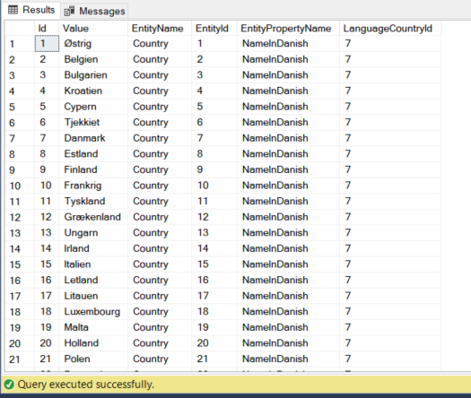
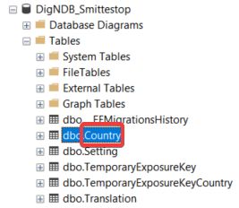
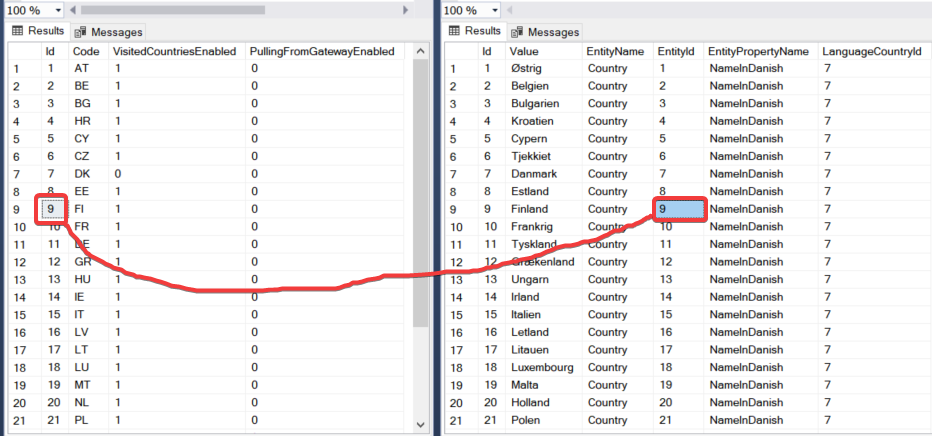
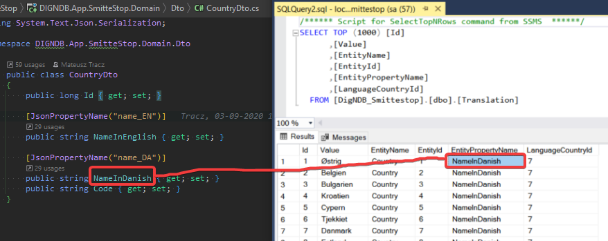

# Communication with EU Federation Gateway Service (EFGS)
<!---
* Briefly describe what is the EFGS, why we integrate with it.
-->


## Links

Specification

https://ec.europa.eu/health/sites/health/files/ehealth/docs/mobileapps_interoperabilitydetailedelements_en.pdf

EFGS repository

https://github.com/eu-federation-gateway-service


GAEN Key Export File specification

https://developers.google.com/android/exposure-notifications/exposure-key-file-format


Protocol Buffers

https://developers.google.com/protocol-buffers


## Jobs

For data synchronization Hangfire Jobs are triggered periodically.

### Maintenance job
This job is triggered once per day and is checking the EFGS integration status. 
Current implementation checks how many keys have been downloaded from EFGS the day before. 
If value is lower than expected the error will be thrown and reported to the System Event Log.

### Known issue 

#### 1. Hangfire nullifies nested objects when passing config DTO to the job

Hangfire is serializing parameters, and it seems to not support deep copy (nested object-reference types will be nulls after deserialization)
https://docs.hangfire.io/en/latest/background-methods/passing-arguments.html

```bash
// to workaround that you can pass serialized json as argument, not the DTO object
RecurringJob.AddOrUpdate<MaintenanceDailySummaryJob>(
    recurringJobId: maitenanceCheckConfig.Name,
    methodCall: job => job.Invoke( maitenanceCheckConfig.toJson() ),
    maitenanceCheckConfig.CronExpression);
```

And deserialize it in the Job
```bash
var config = MaintenanceDailySummaryJob.FromJson(jsonString);
```

#### 2. Hangfire is not handling async code properly 

https://discuss.hangfire.io/t/async-task-jobs/73


In Jobs please use synchronouse calls

##### ProtoBuffer usage

"Proto" file describes contract between the national backend (Smittestopp) and the EFGS. 
The current version can be found here:

https://github.com/eu-federation-gateway-service/efgs-federation-gateway/blob/master/src/main/proto/Efgs.proto


**TIP:** Be aware that EFGS is using version 3 of the PB. 
Version is specified on the beginning of the prosto file: 

```bash 
syntax = "proto3";
```

Google `GAEN Key Export File specyfication` for Android API is mentioning version 2 but this is not valid for the EFGS. 
**For the EFGS requests you need to use a valid (v3) version of protobuffers because** binary data for the same input between those two versions is different and **signature verification of the request will fail otherwise**.

To use protobuffer format you need compile *.proto file to the *.cs file. 
To do that you can use the external compiler:

https://github.com/protocolbuffers/protobuf

**TIP:** The compiler version and the Nuget version used in Smittestop project must be the same. 
For example when you are using `Google.Protobuf v3.13.0` Nuget you need to use `protoc-3.13.0-win64` compiler. 
Otherwise you will see unrecognized types and classes in autogenerated code.

After downloading the compiler please add it to the system Path. 
Example compilation command looks like this:

```bash
protoc --csharp_out=.\Models\Proto\ .\Models\Proto\TemporaryExposureKeyGatewayBatchDto.proto
```

New file will be created: `TemporaryExposureKeyGatewayBatchDto.cs`. 
You can change file name just to mark by convention that it is generated from proto file `TemporaryExposureKeyGatewayBatchDto.proto.cs`


**Autogenerated code shouldn't be modified.** 


## Visited countries configuration
Endpoint with `/countries` routing returns a list of countries.
Mobile application shows this list of countries to the user, so he can choose, which countries he visited.
The application uses this list of visited countries when it pushes the keys.
Backend associates each key with a country when it received them.

Today (16 december 2020), only `version 2` supports this endpoint.
In Norwegian adaptation, configuration marks this version as deprecated (using `DeprecatedVersions` in `appsettings.json`).
Because of this, `version 4` should reintroduce usable `/countries` endpoint again.

### `Country` table
You can configure, which countries the endpoint will return.
To make a certain country not present in the list just set `VisitedCountriesEnabled` column to `false` on `Country` table record.
By default, country of origin (`Norway` in this case) should definitely not appear when choosing visited countries.

You can also configure from which countries the keys will be pulled from EFGS.
To have keys pulled from a specific country you need to set `PullingFromGatewayEnabled` to `true` on `Country` table record.

### `Translation` table

Translation system, implemented with country names translation, enables getting translated data from the API.

As of today (16.12.2020) only `/countries` endpoint makes use of this system. 
The screenshot presents an example of translated country names in Danish.



#### Translation table columns
* `Id` - Primary key of the `Translation` table. 
* `Value` - Translated string.
* `EntityName` - Name of the database table, which we want to translate. 
* `EntityId` - Id of a record, which we want to translate. 
* `EntityPropertyName` - Name of the DTO property, in which we return the translation. 

#### Adding new translation

To add a new translation of for example country names in let’s say French, execute a following insert:
```tsql
INSERT INTO Translation (Value, EntityName, EntityId, EntityPropertyName, LanguageCountryId)
VALUES
       ('Pologne',      -- Poland translated to French
        'Country',      -- Name of the database table
        '21',           -- Id of Poland record in the Country table
        'NameInFrench', -- Field in DTO Country
        10);            -- Id of France record in the Country table

```

Don’t forget to extend the `CountryDto` class with a new field `NameInFrench`.

## Certificates

Two certificates are needed to call the EFGS Api.

   1. SSL certifiacate
   2. Signing Certificate - used to create Batch Signature in upload method
   
To setup the solution:

   1. Public keys should by sent to EFGS team (they need to setup the verification mechanism).
   2. Both certificates in pfx format (containing both - public and private keys) should be added to the servers Certificates Store with "export" option enabled for the valid users.
   3. Valid fingerprints should be configured in the Smittestopp backend application.


### Useful OpenSSL commands
Generate the RSA private key

```bash
openssl genpkey -outform PEM -algorithm RSA -pkeyopt rsa_keygen_bits:4096 -out cert-tls-priv.key
```

Create the CSR

```bash 
openssl req -new -nodes -key cert-tls-priv.key -config certconfig.txt -out cert-tls.csr
```

Self-sign CSR 

```bash
openssl req -x509 -nodes -in cert-tls.csr -days 365 -key cert-tls-priv.key -config certconfig.txt -extensions req_ext -out cert-tls.crt
```

Generate Fingerprint SHA256

```bash
openssl x509 -in dcert-tls.crt -noout -hash -sha256 -fingerprint
```

Generate fingerprint SHA1

```bash
openssl x509 -in cert-tls.crt -noout -fingerprint
```

### Useful links
    https://certificatetools.com/
    https://certlogik.com/decoder/


## FAQ

<!---
* Add some questions, which comes to your mind
* Add questions after meeting with Martin
-->